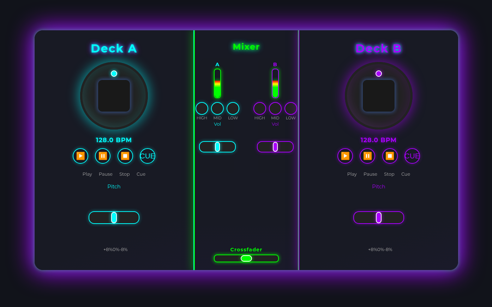

# 🎧 DJ Web Decks

Una aplicación web de DJ con dos decks virtuales para mezclar música desde YouTube. Incluye crossfader, transiciones automáticas y exportación de mezclas a MP3.



## ✨ Características

- 🎛️ **Dos Decks** con controles independientes (Play, Pause, Stop, Cue)
- 🔗 **Carga desde YouTube** - pega cualquier link de video o playlist
- 📋 **Playlists** - carga playlists completas de YouTube
- 🎚️ **Mixer Central** con crossfader y VU meters
- 🔄 **Transiciones suaves** con botón de transición automática
- ⚡ **Auto Mix** - transiciones automáticas al final de cada pista
- ⏺️ **Grabación de Mezclas** - graba tu sesión y expórtala
- 💾 **Exportar a MP3** - conversión automática a MP3 320kbps
- 📱 **PWA** - instalable como aplicación
- 🔒 **Wake Lock** - evita que la pantalla se apague

## 🚀 Instalación Rápida

### Requisitos
- [Node.js](https://nodejs.org/) v18 o superior
- [FFmpeg](https://ffmpeg.org/) (para exportar a MP3)

### Linux / macOS

```bash
git clone https://github.com/tu-usuario/dj-web-decks.git
cd dj-web-decks
chmod +x setup.sh
./setup.sh
```

### Windows

```powershell
git clone https://github.com/tu-usuario/dj-web-decks.git
cd dj-web-decks
powershell -ExecutionPolicy Bypass -File setup.ps1
```

O usa el archivo `.bat`:
```cmd
setup.bat
```

## 📖 Uso

1. Inicia el servidor:
   ```bash
   npm start
   ```

2. Abre en tu navegador: `http://localhost:3555`

3. **Cargar música:**
   - Pega un link de YouTube en el campo de URL de cualquier deck
   - O carga una playlist completa en la sección inferior

4. **Mezclar:**
   - Usa los botones Play/Pause/Stop
   - El crossfader controla el volumen entre los decks
   - Usa "Transición" para un fade automático

5. **Grabar tu sesión:**
   - Presiona ⏺️ REC para empezar a grabar
   - Mezcla todo lo que quieras
   - Presiona ⏹️ STOP para terminar
   - Presiona 💾 Descargar MP3

## ⌨️ Atajos de Teclado

| Tecla | Acción |
|-------|--------|
| `Espacio` | Play/Pause Deck A |
| `Q` | Play Deck A |
| `W` | Pause Deck A |
| `E` | Stop Deck A |
| `P` | Play/Pause Deck B |
| `O` | Play Deck B |
| `I` | Pause Deck B |
| `U` | Stop Deck B |

## 🏗️ Arquitectura

```
dj-web-decks/
├── index.html      # Frontend principal
├── app.js          # Lógica del DJ (Web Audio API)
├── style.css       # Estilos (Glassmorphism)
├── server.js       # Backend Node.js/Express
├── setup.sh        # Script de setup (Linux/macOS)
├── setup.ps1       # Script de setup (Windows PowerShell)
├── setup.bat       # Script de setup (Windows CMD)
└── package.json    # Dependencias npm
```

## 🔧 Dependencias

- **express** - Servidor web
- **axios** - Requests HTTP
- **yt-dlp-wrap** - Wrapper para yt-dlp (descarga de YouTube)
- **FFmpeg** - Conversión de audio (instalación separada)

## ⚠️ Disclaimer

Esta aplicación está diseñada para **uso personal** con contenido al que tienes acceso legítimo. El uso de esta herramienta debe cumplir con los términos de servicio de YouTube y las leyes de copyright de tu jurisdicción.

## 📄 Licencia

MIT License - Úsala como quieras para proyectos personales.

---

Hecho con ❤️ y mucho café ☕
